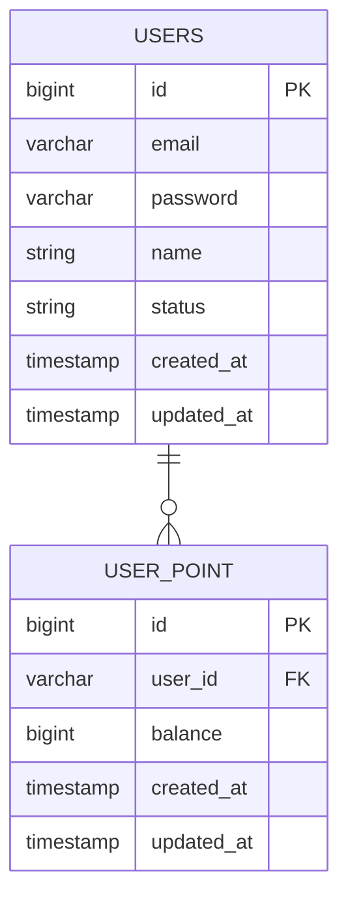
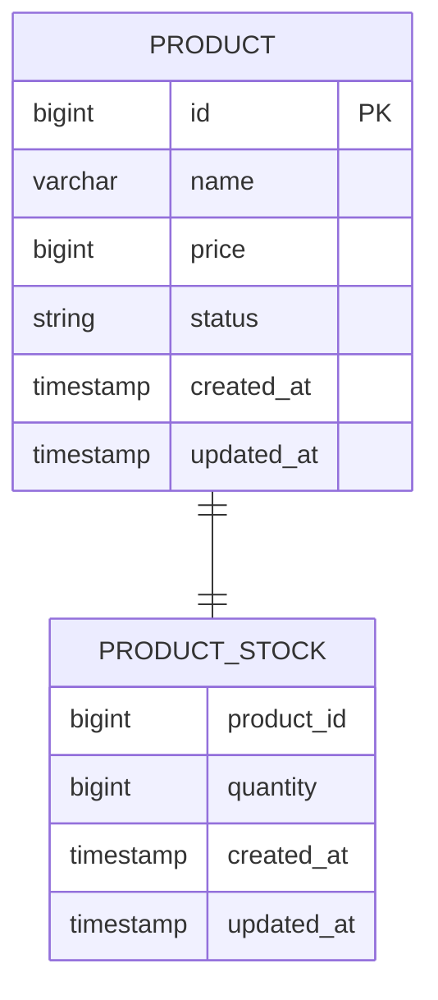
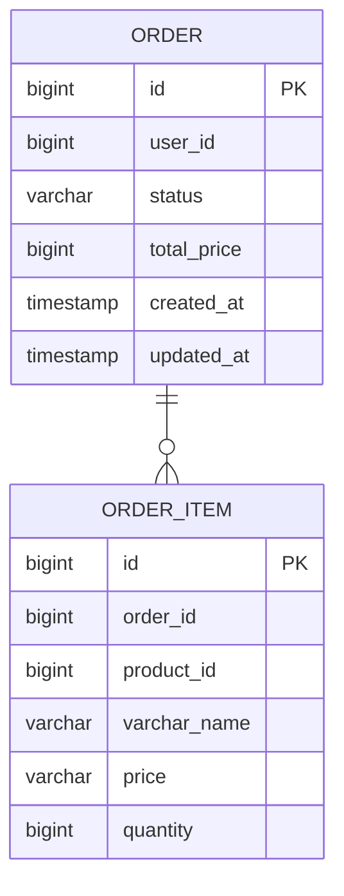
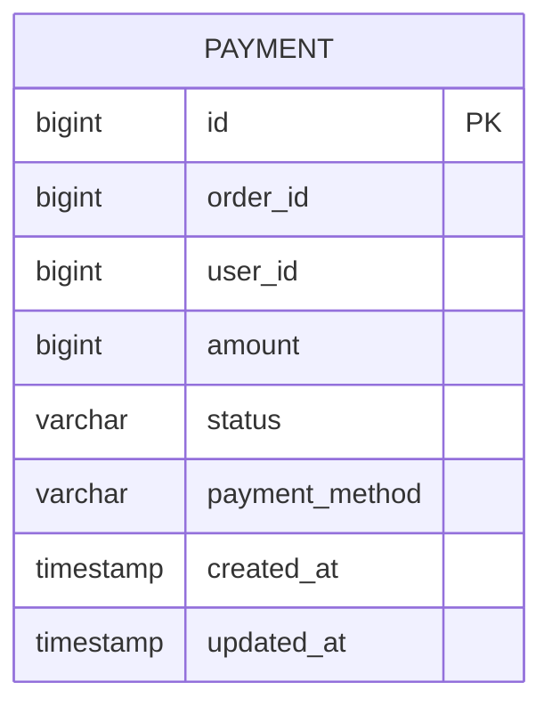
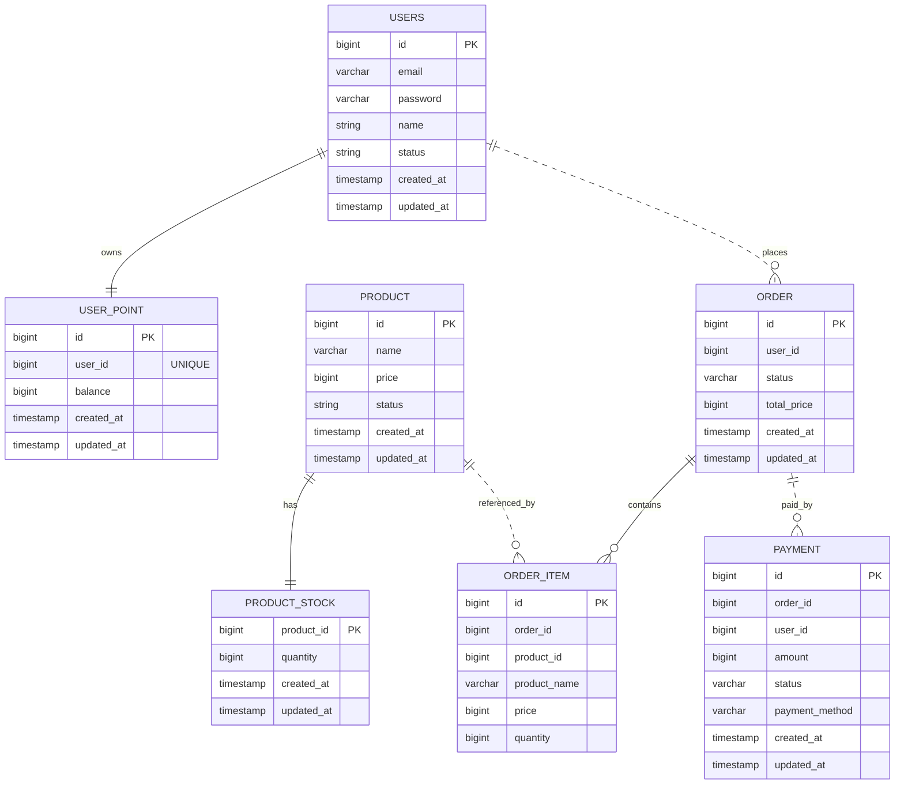

## User ERD

```mermaid
erDiagram
    
    USERS {
        bigint id "PK"
        varchar email
        varchar password 
        string name
        string status
        timestamp created_at
        timestamp updated_at
    }
    
    USER_POINT {
        bigint id "PK"
        varchar user_id "FK"
        bigint balance
        timestamp created_at
        timestamp updated_at
    }
    
    USERS ||--o{ USER_POINT :""
```

## Product ERD

```mermaid
erDiagram
    PRODUCT {
        bigint id "PK"
        varchar name
        bigint price
        string status 
        timestamp created_at
        timestamp updated_at
    }
    
    PRODUCT_STOCK {
        bigint product_id
        bigint quantity
        timestamp created_at
        timestamp updated_at
    }
    
    PRODUCT ||--|| PRODUCT_STOCK : ""
```
## Order ERD

```mermaid
erDiagram
    ORDER {
        bigint id "PK"
        bigint user_id
        varchar status
        bigint total_price
        timestamp created_at
        timestamp updated_at
    }
    
    ORDER_ITEM {
        bigint id "PK"
        bigint order_id
        bigint product_id
        varchar varchar_name
        varchar price
        bigint quantity 
    }
    
    ORDER ||--o{ ORDER_ITEM:""
```

## Payment ERD

```mermaid
erDiagram
    PAYMENT {
        bigint id "PK"
        bigint order_id
        bigint user_id
        bigint amount
        varchar status
        varchar payment_method
        timestamp created_at
        timestamp updated_at
    }


```

```mermaid
erDiagram
%% =======================
%% User Service
%% =======================
    USERS {
        bigint id PK
        varchar email
        varchar password
        string name
        string status
        timestamp created_at
        timestamp updated_at
    }

    USER_POINT {
        bigint id PK
        bigint user_id "UNIQUE"
        bigint balance
        timestamp created_at
        timestamp updated_at
}

USERS ||--|| USER_POINT : owns


%% =======================
%% Product Service
%% =======================
PRODUCT {
bigint id PK
varchar name
bigint price
string status
timestamp created_at
timestamp updated_at
}

PRODUCT_STOCK {
bigint product_id PK
bigint quantity
timestamp created_at
timestamp updated_at
}

PRODUCT ||--|| PRODUCT_STOCK : has


%% =======================
%% Order Service
%% =======================
ORDER {
bigint id PK
bigint user_id
varchar status
bigint total_price
timestamp created_at
timestamp updated_at
}

ORDER_ITEM {
bigint id PK
bigint order_id
bigint product_id
varchar product_name
bigint price
bigint quantity
}

ORDER ||--o{ ORDER_ITEM : contains


%% =======================
%% Payment Service
%% =======================
PAYMENT {
bigint id PK
bigint order_id
bigint user_id
bigint amount
varchar status
varchar payment_method
timestamp created_at
timestamp updated_at
}


%% =======================
%% Logical (Cross-Service) Relations
%% =======================
USERS ||..o{ ORDER : places
ORDER ||..o{ PAYMENT : paid_by
PRODUCT ||..o{ ORDER_ITEM : referenced_by
```