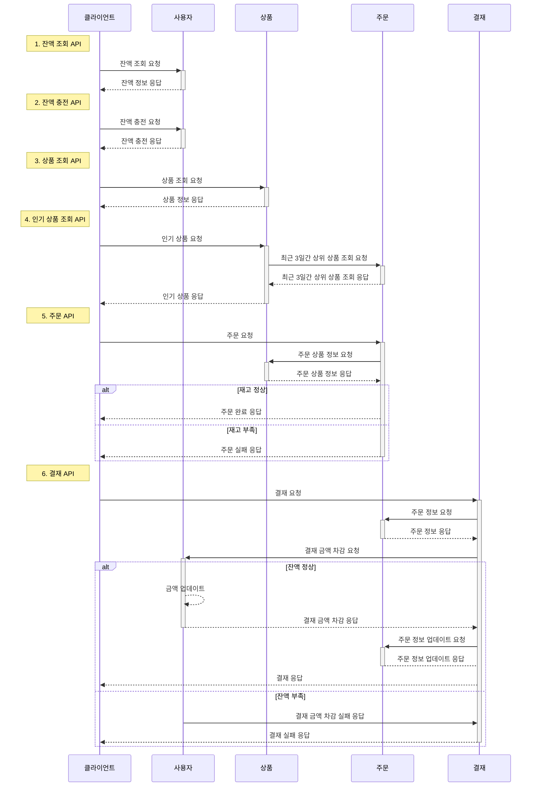

# 시퀀스 다이어그램

```mermaid
sequenceDiagram
    participant 클라이언트
    participant 사용자
    participant 상품
    participant 주문
    participant 결재
%%    participant 장바구니
%%    participant 데이터 플랫폼
    
    Note left of 클라이언트: 1. 잔액 조회 API
    클라이언트 ->>+사용자: 잔액 조회 요청
    사용자 -->>-클라이언트: 잔액 정보 응답

    Note left of 클라이언트: 2. 잔액 충전 API
    클라이언트 ->>+사용자: 잔액 충전 요청
    사용자 -->>-클라이언트: 잔액 충전 응답

    Note left of 클라이언트: 3. 상품 조회 API
    클라이언트 ->>+상품: 상품 조회 요청
    상품 -->>- 클라이언트: 상품 정보 응답

    Note left of 클라이언트: 4. 인기 상품 조회 API
    클라이언트 ->>+ 상품: 인기 상품 요청
    상품 ->>+ 주문: 최근 3일간 상위 상품 조회 요청
    주문 -->>- 상품: 최근 3일간 상위 상품 조회 응답
    상품 -->>- 클라이언트: 인기 상품 응답

    Note left of 클라이언트: 5. 주문 API
    클라이언트 ->>+ 주문: 주문 요청
    주문 ->>+ 상품: 주문 상품 정보 요청
    상품 -->>- 주문: 주문 상품 정보 응답
    
    alt 재고 정상
        주문 -->> 클라이언트: 주문 완료 응답
    else 재고 부족
        주문 -->>- 클라이언트: 주문 실패 응답
    end

    Note left of 클라이언트: 6. 결재 API
    클라이언트 ->>+ 결재: 결재 요청
    결재 ->>+ 주문: 주문 정보 요청
    주문 -->>- 결재: 주문 정보 응답
    결재 ->>+ 사용자: 결재 금액 차감 요청
    
    alt 잔액 정상
        사용자 -->> 사용자: 금액 업데이트
        사용자 -->>- 결재: 결재 금액 차감 응답
        결재 ->>+ 주문: 주문 정보 업데이트 요청
        주문 -->- 결재: 주문 정보 업데이트 응답

        결재 -->> 클라이언트: 결재 응답
    else 잔액 부족
        사용자 ->> 결재: 결재 금액 차감 실패 응답
        결재 -->>- 클라이언트: 결재 실패 응답 
    end
    
    
    
```